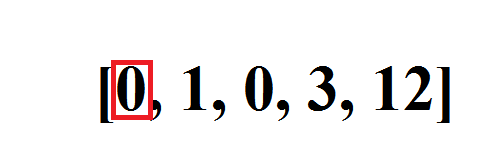
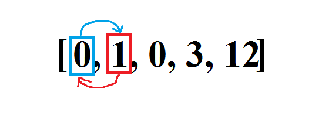
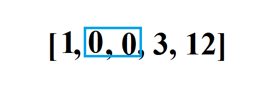
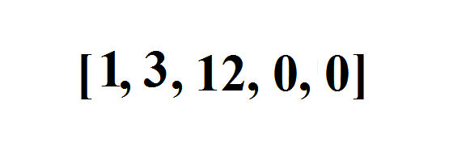

给定一个数组 nums，编写一个函数将所有 0 移动到数组的末尾，同时保持非零元素的相对顺序。

示例:

输入: [0,1,0,3,12]
输出: [1,3,12,0,0]

来源：力扣（LeetCode）
链接：https://leetcode-cn.com/problems/move-zeroes
著作权归领扣网络所有。商业转载请联系官方授权，非商业转载请注明出处。
####　题解
1.把非零元素往前挪，在把它原来的位置置为0，当原来的位置和挪动后的位置相同时，不置0.
```java
public void moveZeros(int[] nums) {
    if (nums == null || nums.length == 0) return;
    int NoNZeroIndex = 0;
    for (int i = 0; i < nums.length；++ i) {
        if (nums[i] != 0) {
            nums[NoNZeroIndex ++] = nums[i];
            if (NoNZeroIndex != i) nums[i] = 0;
        }
    }
}
```  
2.把非零元素往前挪，挪完以后在后面添加0
```java
public void moveZeros(int[] nums) {
    if (nums == null || nums.length == 0) return;
    int NoNZeroIndex = 0;
    for (int num : nums) {
        if (num != 0) {
            nums[NoNZeroIndex ++] = num;
        }
    }
    int zeroIndex = NoNZeroIndex;
    for (int i = zeroIndex; i < nums.length; i++) {
        nums[i] = 0;
    }
}
```   
3.把零往后挪动
```java
public void moveZeros(int[] nums) {
    if (nums == null || nums.length == 0) return;
    int snowBallSize = 0;
    for (int i = 0; i < nums.length; i++) {
        if (nums[i] == 0) snowBallSize ++;
        else if (snowBallSize > 0) {
            nums[i - snowBallSize] = nums[i];
            nums[i] = 0;
        }
    }
}
```  
思路如下：
初始状态：

第一次交换：

雪球大小增加：

... 
最终状态：

参照外站的思路，[链接](https://leetcode.com/problems/move-zeroes/discuss/172432/THE-EASIEST-but-UNUSUAL-snowball-JAVA-solution-BEATS-100-(O(n))-%2B-clear-explanation)

