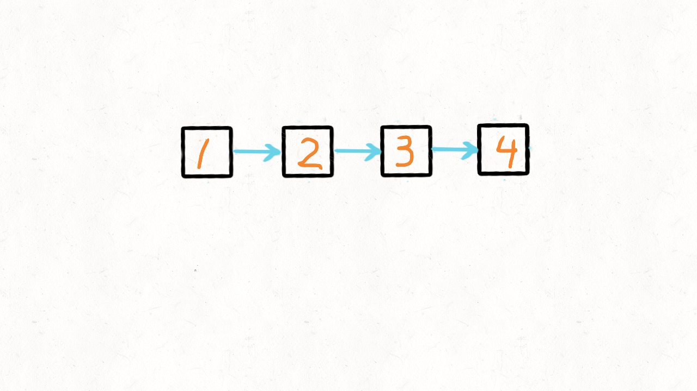

# reversePairs 24 两两交换
给定一个链表，两两交换其中相邻的节点，并返回交换后的链表。

你不能只是单纯的改变节点内部的值，而是需要实际的进行节点交换。

 

示例:

给定 1->2->3->4, 你应该返回 2->1->4->3.

来源：力扣（LeetCode）
链接：https://leetcode-cn.com/problems/swap-nodes-in-pairs
著作权归领扣网络所有。商业转载请联系官方授权，非商业转载请注明出处。  
思路  


1.循环解法
```java
public ListNode reversePairs(ListNode head) {
    if (head == null || head.next == null) {
        return head;
    } 
    ListNode node = new ListNode(-1);
    ListNode res = node;
    while (head != null && head.next != null) {
        node.next = head.next;
        head.next = head.next.next;
        node.next.next = head;

        node = head;
        head = head.next;
    }
    return res;
}
```  

2.递归
```java
public ListNode reversePairs(ListNode head) {
    if (head == null || head.next == null) {
        return head;
    }
    ListNode node = head.next;
    head.next = reversePairs(node.next);
    node.next = head;
    return node;
}
```  
[参考链接](https://leetcode-cn.com/problems/swap-nodes-in-pairs/solution/di-gui-he-fei-di-gui-liang-chong-jie-fa-java-by-re/)

另一个用栈解题的方法，因为递归实际上就是栈，所以贴图展示思路：  
  
[原文](https://leetcode-cn.com/problems/swap-nodes-in-pairs/solution/dong-hua-yan-shi-24-liang-liang-jiao-huan-lian-bia/)